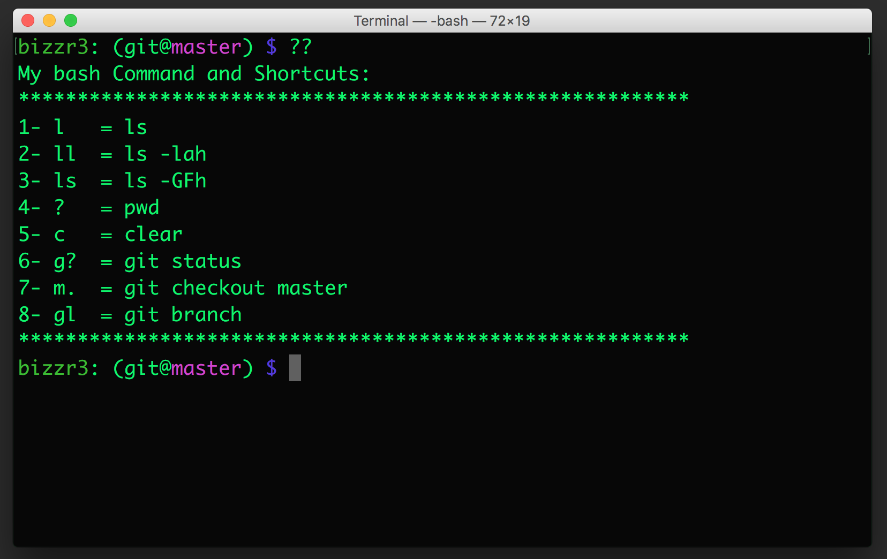

# My Bach Prompt 

These sample codes will help beginners to customize their Bash prompt, and will help Git lovers to have more power while coding.

# Notes
These shell scripts are made for Mac os Terminal.
Please send me your suggestions and also feel free to fork it and update it.

# Screenshots

